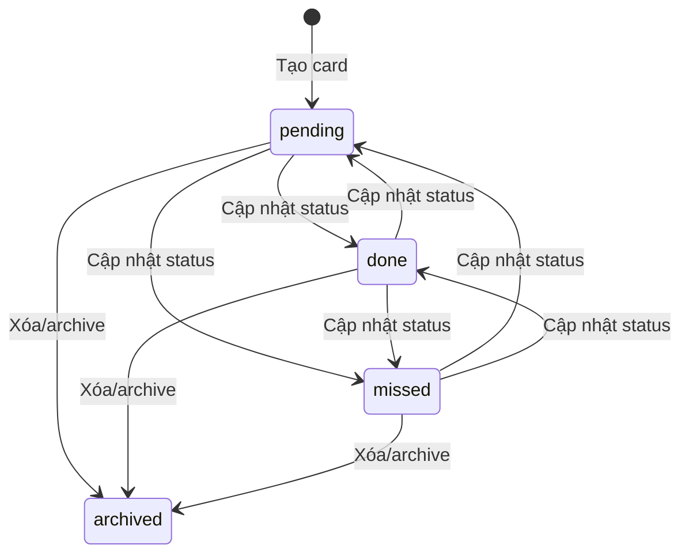
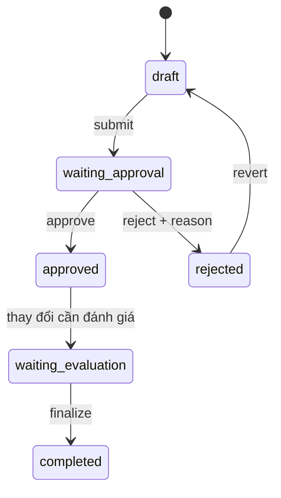

# State & Workflow Analysis

## Card lifecycle

Card có status enum: pending, done, missed; mặc định khi tạo là pending. API update nhận mọi giá trị trong enum và ghi activity status_changed khi khác trạng thái cũ. Không thấy transition matrix chặn chuyển trạng thái.

archived là lưu trữ qua deletedAt, không nằm trong status enum. Xóa list cũng soft-delete cards trong list và tạo activity archived. Có UI copy cho restore board, nhưng route restore đầy đủ chưa được chứng minh.

## Drag & drop

- Kéo list: UI gọi list.update(listPublicId, index) nếu có list:edit hoặc creator; backend gọi reorder.
- Kéo card cùng hoặc sang list khác: UI gọi card.update(cardPublicId, listPublicId, index) nếu có card:edit hoặc creator; backend gọi reorder và cập nhật index/list.
- UI optimistic cache update, invalidate sau mutation và rollback cache khi lỗi.
- Activity cho cập nhật list/index/status được tạo ở backend.

## List lifecycle

List được tạo với name và board; name/index có thể sửa, index có thể reorder. Delete là soft delete; cards thuộc list cũng bị soft delete.

## Reward approval lifecycle

Enum: draft → waiting_approval → approved/rejected; rejected → draft qua revert; approved → waiting_evaluation khi cần đánh giá; waiting_evaluation → completed qua finalize. Submit có validation về ngày, assignee và config; approve tạo snapshot; thay đổi sau snapshot được log violation.

## Recurring task lifecycle

Task master gắn frequency/rrule và khoảng start/end, liên kết task instances. Instance mặc định pending, có thể done hoặc missed; có API create/update/delete/virtual/comment/activity. Scheduler production chưa đủ rõ.

## Member lifecycle

Member status enum: invited, active, removed, paused. Có invite trực tiếp/invite link; accept link là public endpoint. Update role/remove/deactivate được bảo vệ bởi permission/hierarchy.

